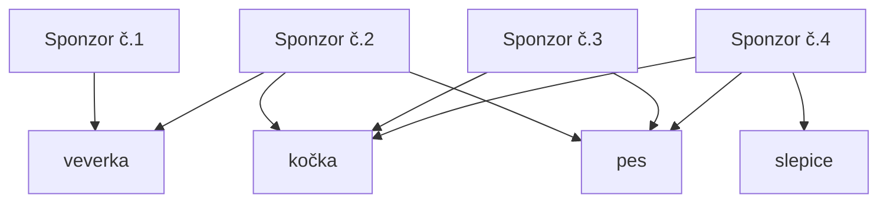
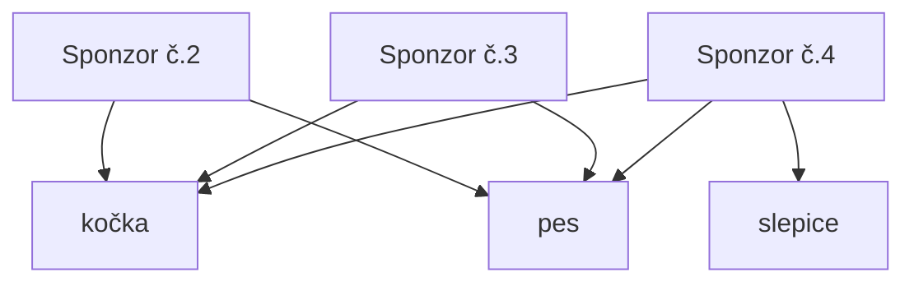
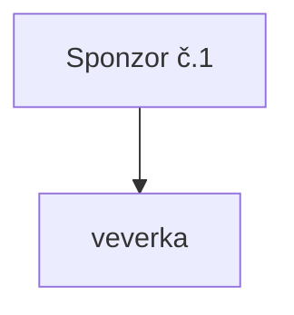
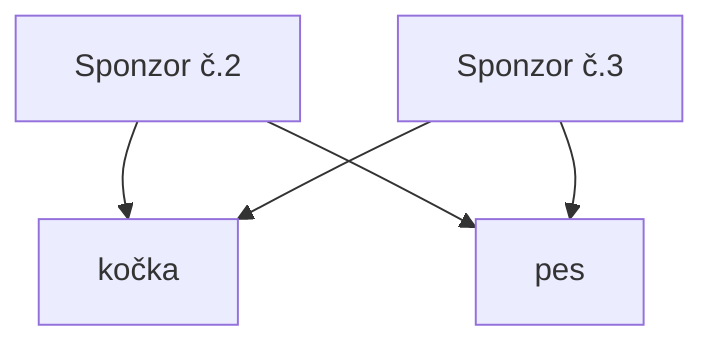
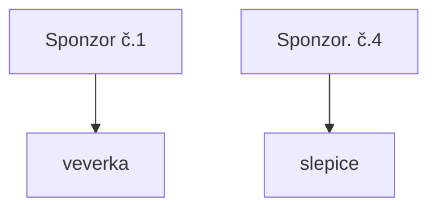
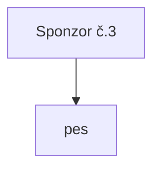
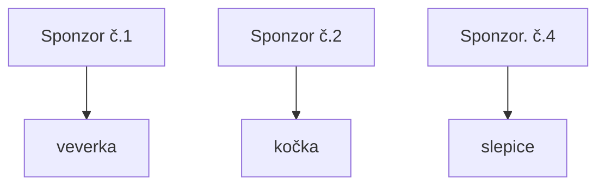
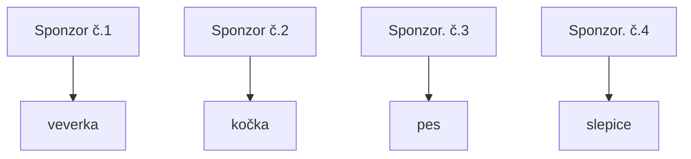

# Řešení úlohy Sponzoři

**8. Ročník, 1. kolo**

## Zjednodušené zadání

- Máme zadáno několik sponzorů, kteří sponzorují zvířata. Zadání nám říká přesně, jaká zvířat může daný sponzor podporovat.
- Úkolem algoritmu je najít ke každému zvířeti vlastního sponzora.
- Limity:
    - **1 <= n <= 100** (Počet zvířat)
    - **1 <= m <= 200** (Počet sponzorů))
    - **0 <= id < n** (Počet id zvířete)
    - **Sponzor** může sponzorovat **maximálně n zvířat** (tj. **100** v nejnáročnějším případě), **minimálně 1 zvíře**.

## Popis řešení

Tento problém si můžeme představit jako graf. To znamená, že si můžeme řešení graficky znázornit. Tady je jedna z nejjednodušších možností:

_Graf (Příklad zadání)_

### Průběh řešení

Můj způsob řešení se skládá z 3 metod:

#### 1. Metoda:
Ve většině případů máme možnost vyloučit **sponzora**, který má přiřazené jen **jedno zvíře** (např. v [grafu č.1](#popis-řešení) Sponzora č.1). Když tohoto sponzora společně s jeho zvířetem vyřadíme a předáme do finálního řešení, máme jistotu, že jsme spojili dvojici správně.

Po přesunutí první dvojice do pole konečného řešení musíme ze stávajících hran, se kterými pracujeme, odebrat všechny hrany které jakkoliv spojují zvíře nebo sponzora, kterého jsme právě přesunuli.

_Graf (Krok 1)_

Takto bude vypadat pole konečného řešení po prvním kroku:

_Řešení (Krok 1)_

#### 2. Metoda:
V případě, že pole neobsahuje sponzora, který má na sebe navázanou jen jednu hranu, můžeme (pokud to jde) aplikovat stejný postup na zvíře (v ukázkovém grafu na slepici)

Po této metodě bude graf vypadat takto:

_Graf (Krok 2)_

A pole konečného řešení takto:

_Řešení (Krok 2)_

#### 3. Metoda:
Když není možné aplikovat ani první, ani druhou metodu, musíme použít třetí.

Vzhledem k tomu, že nelze aplikovat ani jedna z předchozích metod, každý sponzor má minimálně 2 zvířata a každé zvíře má minimálně 2 sponzory.

To znamená, že při spojení náhodné dvojice budeme mít nadále u každého vrcholu minimálně jednu hranu, kterou budeme moci využít k případnému připojení.

Ve třetí metodě tedy spojíme **jakéhokoliv sponzora** s **jakýmkoliv zvířetem**.

Po této metodě nám vznikne graf, který můžeme opět řešit první metodou.

_Graf (Krok 3)_

_Řešení (Krok 3)_

Po opětovném použití 1. metody nám vznikne toto řešení.

_Konečné řešení_

## Asymptotická složitost
- V minulosti jsem se s asymptotickou složitostí nikdy nesetkal a s výpočty jsem si nebyl zcela jist, nicméně dospěl jsem k tomu, že se jedná o kvadratickou nebo kubickou složitost.

## Efektivnější algoritmy
- K propojení bipartijního grafu existuje i [Hopcroft-Karpův algoritmus](https://en.wikipedia.org/wiki/Hopcroft%E2%80%93Karp_algorithm)
  - Ačkoliv je podle asymptotické složitosti **efektivnější**, používám vlastní algoritmus. Jednak protože i největší možné vstupy dokáže s přehledem vyřešit do vteřiny, tak i kvůli tomu, že řešení je možné prakticky "zkopírovat" z [internetu](https://github.com/search?q=hopcroft+karp).

## Spouštění programu

- Ke spuštění programu je potřeba min. verze [php 8.0](https://www.php.net/downloads.php#v8.0.10)
- Nedoporučuji používat JIT
